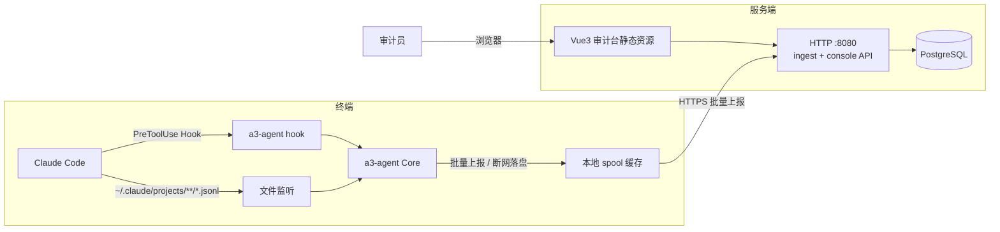

# a3 — AI Agent 行为审计平台

a3（AI Agent Audit）对 AI 编码智能体（当前支持 Claude Code）的工作过程做**全程留痕、风险拦截与集中审计**：
终端侧常驻采集器把会话流解析为标准事件、在工具执行前按规则裁决高危操作，服务端集中落库并提供 Web 审计台
（会话回放、告警中心、设备管理、导出）。

核心能力一览：

- **会话审计**：用户/助手消息、工具调用与结果完整回放，风险事件红色高亮
- **高危拦截**：PreToolUse Hook 在命令执行前判定，`block` 级规则直接阻断（退出码 2）
- **敏感信息防护**：密钥/私钥/连接串等 DLP 规则命中即拦截，命中片段脱敏后展示
- **断网续传**：终端本地磁盘缓存（spool），网络恢复后自动续传，事件不丢
- **设备管理**：指纹去重注册、心跳在线状态、Token 鉴权上报

## 架构



- 终端采集器 `cmd/agent`：Core 引擎 + 插件（`internal/agent/plugins/claude`），插件契约见 [插件开发指南](#插件开发指南)
- 服务端 `cmd/server`：Gin，设备侧 ingest API 与控制台 API，迁移 SQL 内嵌于二进制
- 前端 `web`：Vue3 + Element Plus + Pinia，构建产物由服务端 `A3_WEB_DIST` 托管

## 快速开始（单机一体化部署）

```bash
cp deploy/.env.example deploy/.env     # 1. 编辑 A3_ADMIN_PASSWORD 等配置
make compose-up                        # 2. 构建镜像并拉起 postgres + server
# 3. 浏览器打开 http://127.0.0.1:8080 ，用 .env 中的管理员账号登录
```

停止与清理：`make compose-down`（数据保留在 docker volume `a3_pgdata`）。

服务端环境变量（见 [deploy/.env.example](deploy/.env.example)）：

| 变量 | 说明 | 默认 |
| --- | --- | --- |
| `A3_ADDR` | 监听地址 | `:8080` |
| `A3_DATABASE_URL` | PostgreSQL 连接串 | `postgres://a3:a3@127.0.0.1:5432/a3?sslmode=disable` |
| `A3_ADMIN_USER` / `A3_ADMIN_PASSWORD` | 种子管理员；口令留空则随机生成并打印日志 | `admin` / 空(随机) |
| `A3_JWT_SECRET` | 登录态签名密钥；留空则每次重启随机生成(需重新登录) | 空(随机) |
| `A3_ALLOW_AUTO_REGISTER` | 是否开放终端自助注册 | `true` |
| `A3_WEB_DIST` | 前端静态目录；空则不托管 | 空 |

## 客户端接入

从 `make release-agent` 产物（`bin/release/a3-agent-*`）选取对应平台二进制，或源码构建 `make build-agent`。

### 模式一：单机自助注册

适合个人/小团队，服务端 `A3_ALLOW_AUTO_REGISTER=true` 时开箱即用：

```bash
./a3-agent register --server http://a3.example.com:8080   # 注册并保存 Token 到 ~/.a3/
./a3-agent install-hook                                   # 安装 PreToolUse Hook
./a3-agent run                                            # 常驻采集与上报
```

同指纹重复注册返回既有设备身份并轮换 Token。自签名 HTTPS 场景加 `--insecure-skip-tls-verify`。

### 模式二：团队集中登记

服务端以 [deploy/docker-compose.team.yml](deploy/docker-compose.team.yml) 部署时 `A3_ALLOW_AUTO_REGISTER=false`，
未知设备注册返回 403。v1 的接入流程见该文件头部说明（临时开放注册 → 设备 `register` → 改回关闭）。
已登记设备可用环境变量固定凭据运行：

```bash
export A3_SERVER_URL=https://a3.example.internal
export A3_DEVICE_TOKEN=a3d_xxx           # 注册成功时下发，仅此一次明文出现
./a3-agent run
```

采集器常用环境变量：

| 变量 | 说明 | 默认 |
| --- | --- | --- |
| `A3_SERVER_URL` | 服务端地址 | `http://127.0.0.1:8080` |
| `A3_DEVICE_TOKEN` | 设备 Token | 无(需 register 或 env 提供) |
| `A3_SPOOL_DIR` | 断网缓存目录 | `~/.a3/spool` |
| `A3_STATE_DIR` | 身份/位点状态目录 | `~/.a3` |
| `A3_BATCH_SIZE` | 上报批大小 | 200 |
| `A3_FLUSH_INTERVAL` | 上报间隔 | 5s |
| `A3_MASK_ENABLED` | 敏感片段脱敏开关 | `true` |
| `A3_INSECURE_SKIP_TLS_VERIFY` | 跳过证书校验(自签名) | `false` |
| `A3_LOG_LEVEL` | debug/info/warn/error | `info` |

### Hook 安装说明

`install-hook` 向 `~/.claude/settings.json` 幂等写入 PreToolUse 配置（指向
`a3-agent hook pretooluse`），可重复执行不产生重复项；`uninstall-hook` 还原。
Hook 进程与 `run` 进程共享 spool 目录：即使采集器未常驻，被拦截的风险事件也会先落本地缓存，
下次 `run` 启动后自动补报。Hook 配置读取失败时自动退回默认配置继续裁决，绝不阻断正常工作流。

## 插件开发指南

所有 Agent 差异化能力收敛于 `internal/agent/core/plugin.go` 的 `Plugin` 接口，
Core 只依赖该接口——新增一种 AI Agent 只需实现五个方法：

```go
type Plugin interface {
    // Name 插件唯一标识（如 claude-code），注册表据此去重。
    Name() string

    // LogWatchSpecs 声明需要监听的日志目录与文件规则；
    // homeDir 为当前用户主目录（插件据此推导工具私有日志路径）。
    LogWatchSpecs(homeDir string) []LogWatchSpec

    // ParseLine 将一行私有日志解析为标准事件序列；噪音行返回 nil 不产出事件。
    ParseLine(sourcePath string, line []byte) ([]schema.Event, error)

    // EvaluateHook 处理前置 Hook 输入并给出放行/阻断裁决与风险事件。
    EvaluateHook(hookRequest HookRequest) (HookDecision, error)

    // ConfigureHook 在宿主工具配置中安装(true)/卸载(false)前置 Hook；
    // 实现须保证幂等与可还原。
    ConfigureHook(homeDir string, enable bool) (changed bool, err error)
}
```

参考实现：`internal/agent/plugins/claude`（Claude Code 插件——JSONL 会话解析、
PreToolUse 裁决、`~/.claude/settings.json` Hook 管理）。事件模型见 `pkg/schema/event.go`。

## 风险规则

内置 14 条预置规则（终端 `internal/agent/plugins/claude/rules.go` 与服务端种子同源），
类别 `dlp`(敏感信息)/`cmd`(危险命令)/`file`(敏感文件)/`git`(版本控制)，
动作 `block`(Hook 直接阻断)/`alert`(记录并告警)：

| 规则 ID | 名称 | 类别 | 等级 | 动作 |
| --- | --- | --- | --- | --- |
| dlp.aws_access_key | AWS AccessKey 泄露 | dlp | high | block |
| dlp.aws_secret_key | AWS SecretKey 泄露 | dlp | high | block |
| dlp.private_key_block | 私钥文件内容泄露 | dlp | high | block |
| dlp.generic_api_key | 通用 API 密钥泄露 | dlp | high | block |
| dlp.jwt | JWT 令牌泄露 | dlp | high | block |
| dlp.db_conn_string | 数据库连接串凭证泄露 | dlp | high | block |
| cmd.rm_rf_root | 高危递归强删(rm -rf 根/家目录) | cmd | high | block |
| cmd.git_force_push | Git 强制推送 | git | high | block |
| cmd.remote_script_exec | 远程脚本管道执行 | cmd | high | block |
| cmd.chmod_privilege | 全权限放开(chmod 777 系统路径) | cmd | high | block |
| cmd.disk_wipe | 磁盘抹写/格式化 | cmd | high | block |
| file.ssh_private_read | 敏感私钥文件访问 | file | high | block |
| file.dotenv_access | 环境变量文件访问 | file | high | alert |
| git.history_rewrite | Git 历史重写 | git | medium | alert |

## 隐私与脱敏

- 会话内容仅在企业内网服务端落库，用于安全审计；终端到服务端走 HTTPS，设备 Token 鉴权
- 规则命中的代码/命令片段默认**脱敏展示**：命中部分超过 8 字符时保留前 4 后 2、中间打码，
  上下文窗口 ±80 字符；`A3_MASK_ENABLED=false` 可关闭（不建议）
- Hook 阻断仅在规则命中的高风险操作上发生（退出码 2 并向 Claude Code 返回中文原因），
  其余工具调用一律放行，不影响正常开发流程
- 采集范围限于 Claude Code 自身的会话日志目录与 Hook 输入，不扫描其他用户文件

## 更多文档

- [业务说明（BRD）](docs/a3%20%28AI%20Agent%20Audit%29%20_%20开源项目业务说明%20%28README-Style%20BRD%29.md)
- [整体软件技术架构设计](docs/a3%20(AI%20Agent%20Audit)%20整体软件技术架构设计（通用可扩展基座）.md)
- [v1.0 一期落地技术方案](docs/a3%20v1.0%20一期落地技术方案（ClaudeCode%20专属实现文档）.md)

## 开发

```bash
make test            # 全量测试(-p 1 串行集成测试)
make build-agent     # 构建采集器 bin/a3-agent
make build-server    # 构建服务端 bin/a3-server
make build-web       # 构建前端 web/dist
make dev-db-up       # 本地开发 PostgreSQL(:5433)
```
